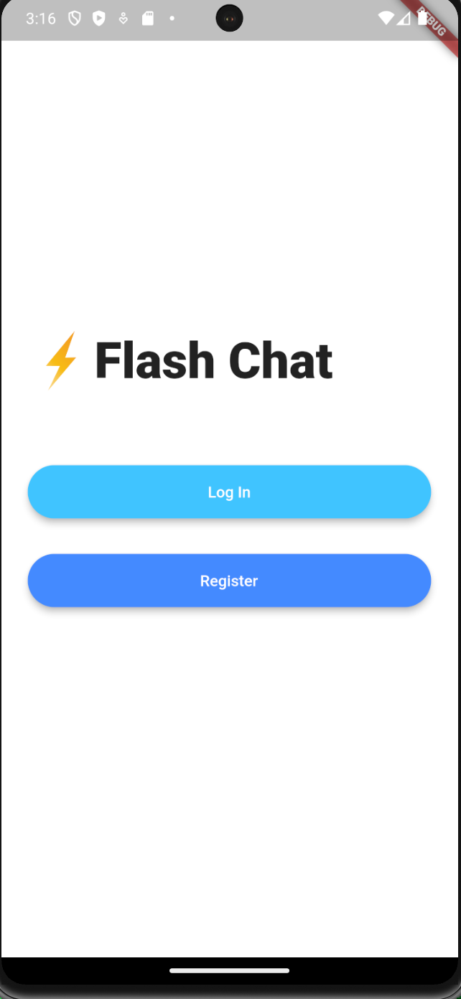

# Flash Chat App

### [Link to flutter tutorial](https://www.udemy.com/course/flutter-bootcamp-with-dart/?couponCode=OF53124)

## Overview:
- Flash chat is a simple chat application that allows a user to register and sign in to the application and allows them to communicate with other users using firebase firestore. 

## What I learn about flutter/dart with project: 
- Static Modifier
- Multi Route Navigator
- Animations
- Mixins
- Streams
- ListView
- Saving data to a database
- Authentication

## Screenshots: 

    
    
    
    
    
    
    

## Installation/Running steps :computer: :
### :warning: To run project you need a firebase account & firebase project setup for flash chat :warning:

- [Link to creating google firebase account](https://firebase.google.com/)

## Firebase Authentication and Database
1. Create a new project in [firebase console](https://console.firebase.google.com/) called flash-chat.
2. [Install flutterfire CLI](https://firebase.flutter.dev/docs/cli/#installation) on your machine.
3. In the root of this project (the directory containing `pubspec.yaml`), run the following:
    - `flutterfire configure`
       - This command asks you for the name of the Firebase project that you created earlier, and the list of target platforms you support. 
        - The command rewrites lib/firebase_options.dart with the correct code.

4. Run `flutter packages get`
5. Run `flutter run` to build and run the debug app on your emulator/phone

